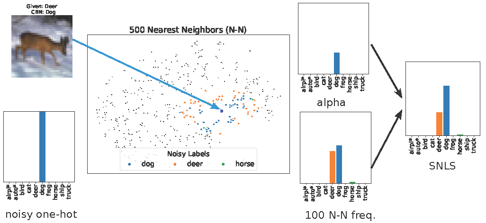
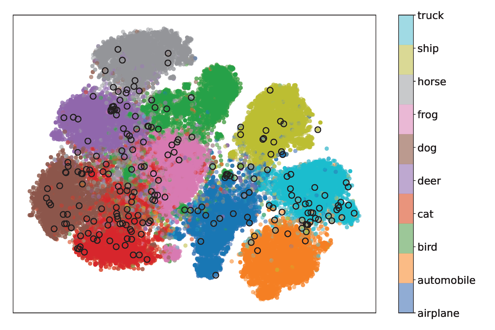
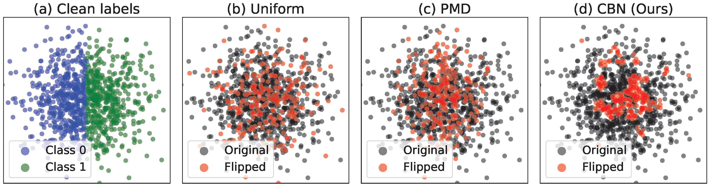

# Robust Testing for Deep Learning using Human Label Noise 🤖



Welcome to the code repository for **Robust Testing for Deep Learning using Human Label Noise**! This project introduces new methods to analyze and address human label noise in machine learning.

---

## Repository Overview 🗂️

This repository is structured into three main parts:

1. **Label Memorization of Human Noisy Labels** 🧠  
Our paper presents the first study to analyze memorization scores of human noisy labels derived using held-out estimation. Using the CIFAR-10N dataset with human noisy labels, we provide label memorization scores obtained from training 1,500 ResNet34 models. The repository also includes code to reproduce Figures 1 through 4 from our paper.

   **Folder:** `label_memorization/`  

   

2. **Cluster-Based Noise (CBN)** 🎯  
Inspired by our observations from the study of label memorization in human noisy labels, we propose Cluster-Based Noise (CBN), a method to generate more challenging, feature-dependent noise. This section includes generated labels for various noise levels on CIFAR-10 and CIFAR-100, as well as label noise files from [PMD noise](https://github.com/pxiangwu/PLC).

   **Folder:** `label_noise/`  


   

3. **Soft Neighbor Label Sampling (SNLS)** 🛠️  
We introduce a novel approach to train models effectively on datasets with Cluster-Based Noise. This section provides code to reproduce the results of our experiments and benchmarks against other methods.

   **Folder:** `lnl_methods/`

## Citation 📜

If you use this code, please cite us:  
```bibtex
@inproceedings{lim25snls,
author = {Lim, Gordon and Larson, Stefan and Leach, Kevin},
title = {Robust Testing for Deep Learning using Human Label Noise},
year = {2025},
series = {DeepTest '25}
}

```

---

Feel free to open an issue or contribute to this repository. Happy testing! 🎉
